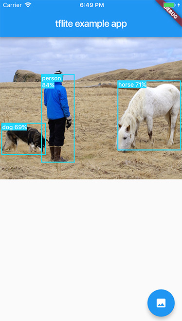

# tflite_example

Use tflite plugin to run model on images. The image is captured by camera or selected from gallery (with the help of [image_picker](https://pub.dartlang.org/packages/image_picker) plugin).

 

## Prerequisites

Create a `assets` folder. From https://github.com/shaqian/flutter_tflite/tree/master/example/assets
dowload the following files and place them in `assets` folder.
 - mobilenet_v1_1.0_224.tflite
 - mobilenet_v1_1.0_224.txt
 - ssd_mobilenet.tflite
 - ssd_mobilenet.txt
 - yolov2_tiny.tflite
 - yolov2_tiny.txt
 - deeplabv3_257_mv_gpu.tflite
 - deeplabv3_257_mv_gpu.txt
 - posenet_mv1_075_float_from_checkpoints.tflite

## Install 

```
flutter packages get
```

## Run

```
flutter run
```

## Caveat

```recognizeImageBinary(image)``` (sample code for ```runModelOnBinary```) is slow on iOS when decoding image due to a [known issue](https://github.com/brendan-duncan/image/issues/55) with image package.
